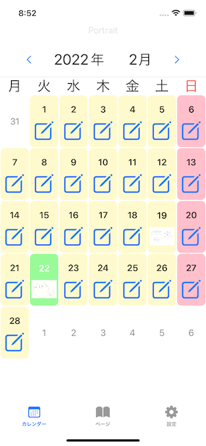
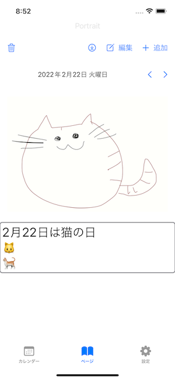
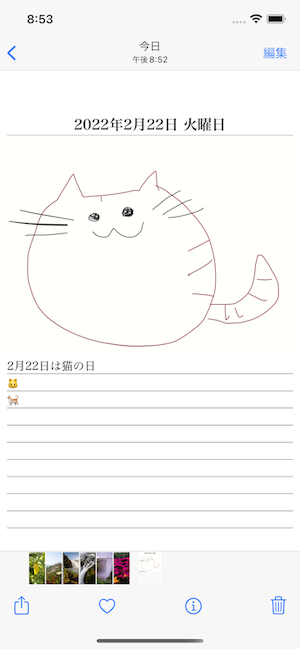

# DrawNikki

絵日記アプリ

## スクリーンショット

月ごとに表示|絵日記ページ|カメラロールに出力
---|---|---
||

## CoreData

* File_number

Attribute | Type | Description
---|---|---
number | Integer 32 | 最後に使用したファイルの連番
created_at | Date | レコード作成日時
updated_at | Date | レコード更新日時

* Nikki

Attribute | Type | Description
---|---|---
id | UUID | ユニークキー
date | Date | 日記の日付
number | Integer 32 | 同じ日での連番(1日に複数の日記が書ける)
picture_filename | String | 画像ファイルパス
text_filename | String | テキストファイルパス
created_at | Date | レコード作成日時
updated_at | Date | レコード更新日時

